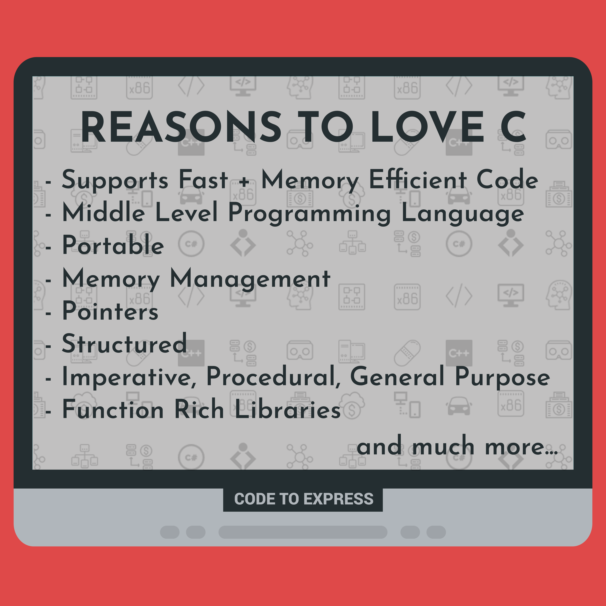

# C Language

C is a general-purpose, imperative computer programming language, supporting structured programming, lexical variable scope and recursion, while a static type system prevents many unintended operations. By design, C provides constructs that map efficiently to typical machine instructions, and therefore it has found lasting use in applications that had formerly been coded in assembly language, including operating systems, as well as various application software for computers ranging from supercomputers to embedded systems.

## Features

- Supports Fast + Memory Efficient Code
- Middle Level Programming Language
- Portable
- Memory Management
- Pointers
- Structured
- Imperative, Procedural, General Purpose
- Rich Libraries and Community

## Uses

- Operating Systems
- Language Compilers
- Assemblers
- Text Editors
- Print Spoolers
- Network Drivers
- Modern Programs
- Data Bases
- Language Interpreters
- Utilities

## Characteristics of C Language

Source: [mobilei95.com](http://www.mobilei95.com/features-characteristics-c-programming-language)

1) C is a General Purpose Programming Language This means C can be used to write a variety of applications. It is often referred to as a “system programming language.”

2) C is a middle level language, which means it combines the features of high level language with the functionality of an assembly language.

3) C is a structured programming language, which means as a programmer, you are required to divide a problem into a several different modules or functions.

4) C is renowned for its simplicity and is easy to use because of its structured approach. It has a vast collection of keywords, operators, built-in functions and data types which make it efficient and powerful.

5) C is portable, which means a C program runs in different environments. C compilers are available for all operating systems and hardware platforms. Additionally, you can easily write code on one system and port it to another.

6) C is popular not just because it can be used as a standalone programming language, but also as it can be used as an interface to other more visual languages.

7) C is a very flexible language; it is convenient and portable, like a high level language and flexible like a low level language. It can be interfaced with other programming languages.

8) C is super fast. The compilation and execution of programs is much faster on C than with most other languages.

9) C is modular, which means C programs can be divided into small modules, which are much easier to understand.

10) C is easily available. The C software is easy to access and can be easily installed on your computer. The installation of C hardly takes a few minutes.

11) C is easy to debug. The C compiler detects syntax errors quickly and easily and displays the errors along with the line numbers of the code and the error message.

12) C makes available a number of in-built memory management functions that save memory and improve the efficiency of the program such as malloc(), calloc() and alloc().

13) Recursion is one of the common techniques used in C, where in a function calls itself again and again.

14) Finally,  C has a rich set of library functions and supports graphic programming too.

## References

- http://www.mobilei95.com/features-characteristics-c-programming-language
- https://www.le.ac.uk/users/rjm1/cotter/page_05.htm
- https://www.javatpoint.com/features-of-c-language