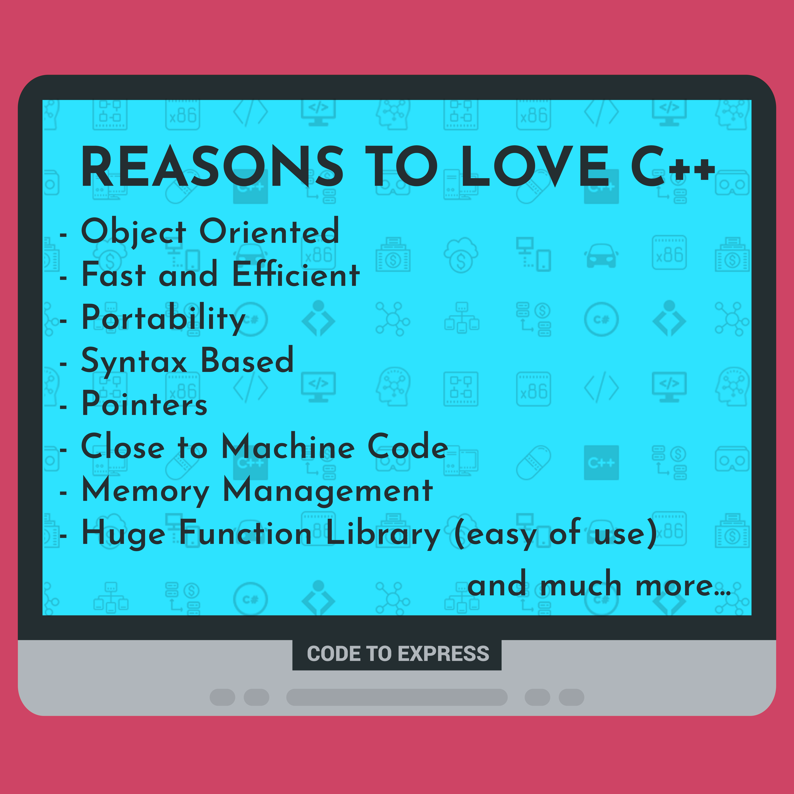

# C++

C++ is a general-purpose programming language. It has imperative, object-oriented and generic programming features, while also providing facilities for low-level memory manipulation.

## Features

- Object-oriented
- Fast and Efficient
- Portability
- Syntax Based
- Pointers
- Close to Machine Code
- Memory Management
- Rich Library Support

## Uses

- Operating Systems
- Web Browsers
- Assemblers
- Embedded Systems
- Machine Learning Libraries
- Graphics
- Banking Applications
- Cloud
- Distributed Systems
- Compilers

## References

- https://www.sitesbay.com/cpp/features-of-cpp
- https://hackr.io/blog/uses-applications-of-c-plus-plus-language