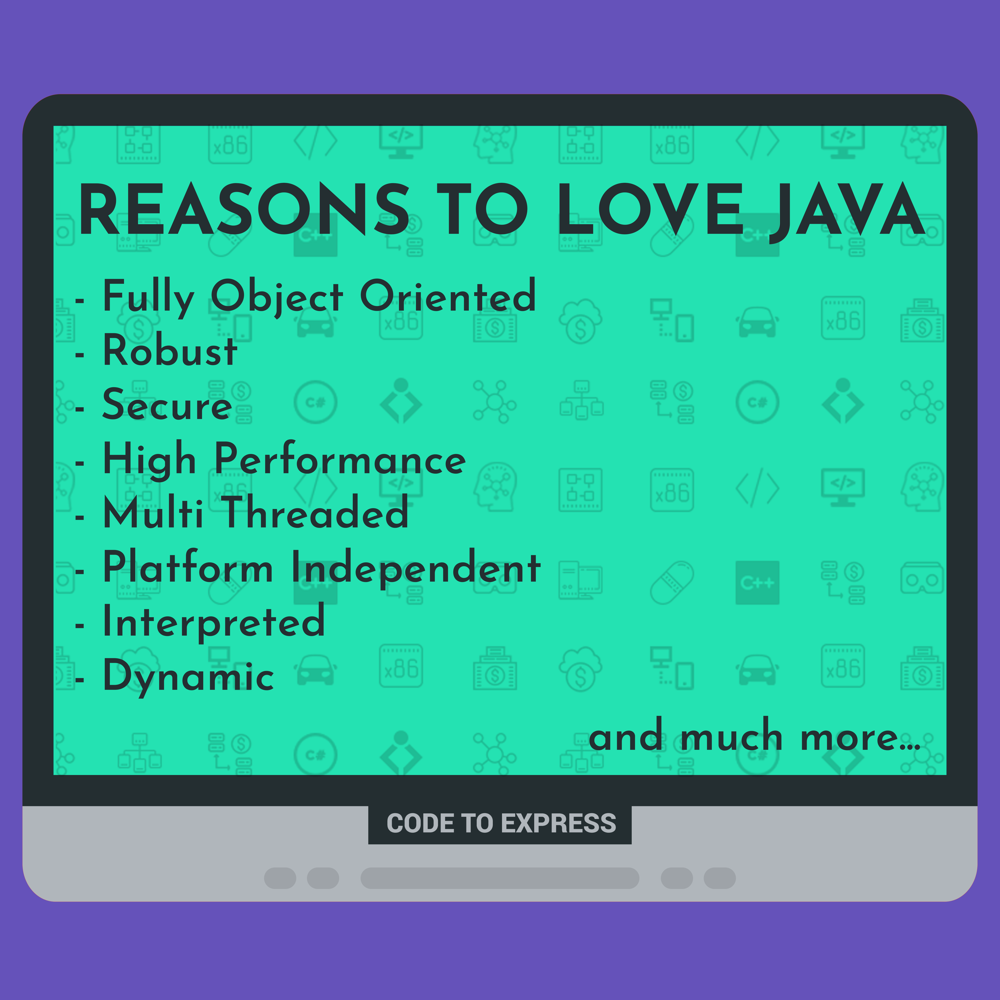

# Java

Java is a general-purpose computer-programming language that is concurrent, class-based, object-oriented, and specifically designed to have as few implementation dependencies as possible. It is intended to let application developers "write once, run anywhere" (WORA), meaning that compiled Java code can run on all platforms that support Java without the need for recompilation.

## Features

- Fully Object Oriented
- Robust
- Secure
- High Performance
- Multi Threaded
- Platform Independent
- Interpreted
- Dynamic
- Easy To Learn
- Distributed
- Portable

## Uses

- Desktop GUI Applications
- Moble Applications
- Embedded Systems
- Web Applications
- Web Servers and App Servers
- Enterprise Applications
- Scientific Applications

## References

- https://www.javatpoint.com/features-of-java
- https://www.invensis.net/blog/it/applications-java-programming-language/